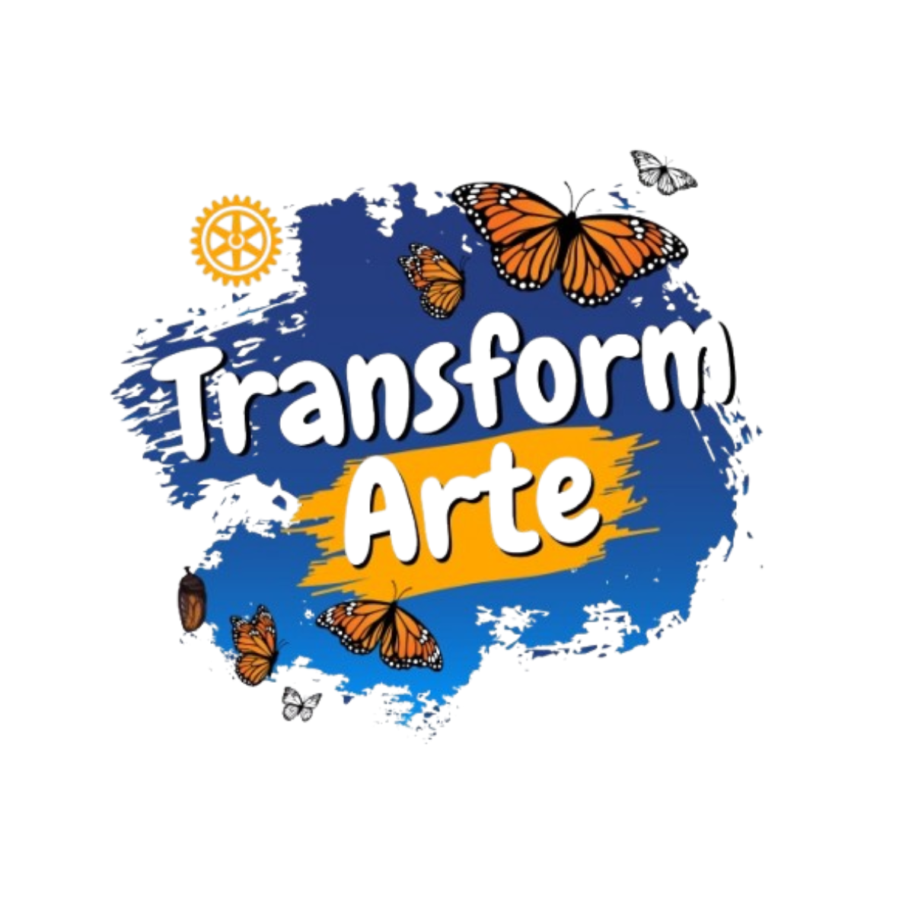

<p align="center">
  
</p>

<h1 align="center">TransformArte</h1>
<p align="center"><em>Donde el Arte y la Salud Mental se Encuentran &nbsp;·&nbsp; Where Art and Mental Health Meet</em></p>

<p align="center">
  <a href="https://transform-arte.com.mx" target="_blank"><strong>🌐 transform-arte.com.mx</strong></a>
</p>

<p align="center">
  
  
  
  
  
  
</p>

---

## About

TransformArte is the official platform for a **Rotary District 4130** social initiative in Monterrey, Mexico, that uses art exhibitions and psychology-based workshops to raise awareness about youth mental health.

I led the end-to-end design, development, and delivery of this platform as **Technology Lead** (May 2025 – Present), building a full-stack community and fundraising system that centralized donor engagement, artwork submissions, and program operations for a Rotary-backed nonprofit serving 7 cities across Mexico.

> **504,000** children and adolescents in Mexico suffer from a mental health condition.  
> **22.6%** do not have access to mental health services.  
> TransformArte connects art, psychology, and community to change that.

---

## Features

| Area | What it does |
|---|---|
| **Bilingual (ES / EN)** | Full i18n via `next-intl`, cookie-persisted locale, always-prefix routing (`/es/*`, `/en/*`) |
| **Artwork gallery** | Curated catalog of donated artworks with lightbox viewer and approval workflow |
| **Donation funnel** | Integrated with [Recaudia](https://alwayson.recaudia.com/cmrr/donor) + QR code + bank transfer info |
| **Community forum** | Posts with multi-image carousel, nested comments, moderation |
| **Artwork donation** | Artists submit work with image upload (HEIC → JPEG auto-conversion for iOS) |
| **Admin dashboard** | Approve artworks, moderate posts/comments, manage contacts, export CSVs |
| **Auth system** | Email/password registration, JWT in httpOnly cookies (30-day sessions), bcryptjs hashing |
| **Lead capture** | File-upload lead form with Supabase Storage |
| **Visit analytics** | Page-level visit tracking with optional IP geolocation |
| **Event listings** | 7-city tour dates (Monterrey → Tampico → Matamoros, Jul 2026 – Apr 2027) |

---

## Tech Stack

```
Frontend       Next.js 15 (App Router) · React 18 · TypeScript · Tailwind CSS
Backend        Next.js API Routes · Prisma ORM · Zod validation
Database       PostgreSQL via Supabase · 12 models · row-level access control
Storage        Supabase Storage (artworks, forum images, lead files)
Auth           JWT (jose, HS256) · bcryptjs · httpOnly cookies
i18n           next-intl · ES default · EN supported
Security       CSP · HSTS · X-Frame-Options · Rate limiting · CORS
Monitoring     Sentry (@sentry/nextjs)
Deployment     Vercel (Git-integrated, automatic deploys)
```

---

## Getting Started

```bash
# 1. Install dependencies
npm install

# 2. Copy environment template and fill in your values
cp .env.example .env.local

# 3. Run the development server
npm run dev
```

Open [http://localhost:3000](http://localhost:3000). The app redirects to `/es` by default.

### Required environment variables

| Variable | Description |
|---|---|
| `DATABASE_URL` | Supabase PostgreSQL connection string (pooled) |
| `DIRECT_URL` | Supabase PostgreSQL direct connection (bypasses PgBouncer) |
| `SUPABASE_URL` | Supabase project URL |
| `SUPABASE_SERVICE_ROLE_KEY` | Supabase service-role key (server-only, never exposed to browser) |
| `JWT_SECRET` | Secret for signing session tokens — generate with `openssl rand -hex 32` |

See [`.env.example`](.env.example) for the full list including optional variables.

---

## Project Structure

```
src/
├── app/
│   ├── [locale]/          # All user-facing pages (bilingual)
│   │   ├── page.tsx       # Homepage
│   │   ├── catalogo/      # Artwork gallery
│   │   ├── comunidad/     # Community forum
│   │   ├── donar/         # Artwork donation form
│   │   ├── admin/         # Admin dashboard
│   │   └── ...
│   └── api/               # 18 API route handlers
├── components/            # Shared UI (Navbar, Footer, MobileNav, SignedImg…)
├── lib/                   # Singletons: auth, prisma, supabase, security
├── hooks/                 # useNavTranslations
└── types/                 # Shared TypeScript interfaces
messages/
├── es.json                # Spanish translations
└── en.json                # English translations
prisma/
└── schema.prisma          # 12 models, PostgreSQL
```

---

## Deployment

The project is deployed to [transform-arte.com.mx](https://transform-arte.com.mx) via Vercel's Git integration. Every push to `main` triggers an automatic production deploy.

```bash
# Build locally to verify before pushing
npm run build
```

> **Note:** Do not create new Vercel projects. The repository is already linked to the production domain.

---

## License

This project is proprietary software developed for **Club Rotario Monterrey Metropolitano A.C.** — Rotary District 4130. All rights reserved.
